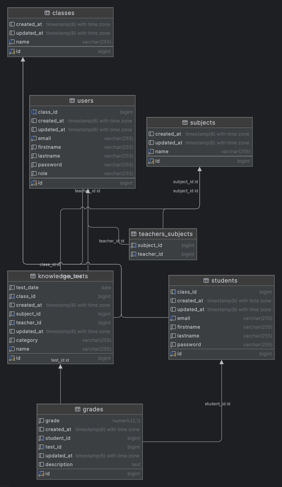
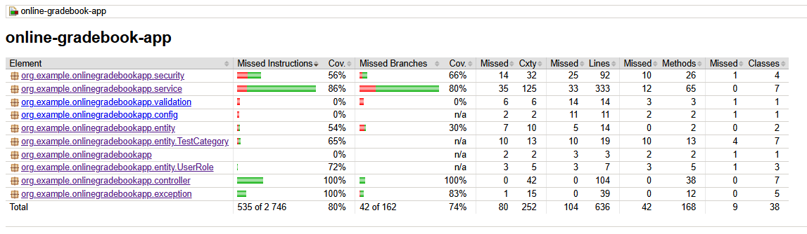
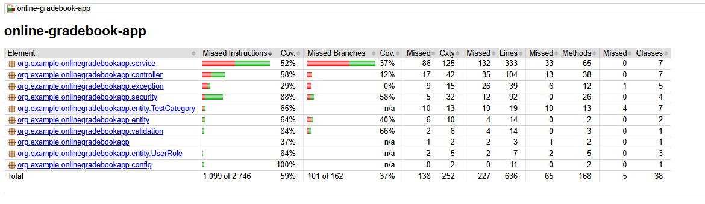

# 📘 Online gradebook app - Spring Boot REST API

The REST API application for managing students, teachers, classes, knowledge tests and grades.
Supports different roles of users (ADMIN, TEACHER) and access control based on roles and identifiers.

---

## Table of contents

1. [Technologies](#-technologies)
2. [Architecture and design patterns](#-architecture-and-design-patterns)
3. [Starting application](#-starting-application)
4. [Database structure](#-database-structure)
5. [Testing](#-testing)
6. [Security](#-security)
7. [Role Permissions](#-role-permissions)

---

## 🧰 Technologies

- Java 17+
- Spring Boot
- Spring Security (JWT)
- Spring Data JPA
- PostgresSQL 17
- Maven 3.4.4
- TestContainers, JUnit 5
- Lombok
- Flyway (database migration)

---

## ⚙️ Architecture and design patterns

- Three-layer architecture (Controller - Service - Repository)
- MVC Design Pattern
- Repository pattern
- DTO (Data Transfer Object) pattern
- Singleton (Spring beans)

---

## 🚀 Starting application

### Option 1 - locally

#### Requirements

- Java 17+
- Maven 3.4.4+
- PostgresSQL

#### DB configuration:

1. Create database and user:

    ```sql
    CREATE DATABASE online_grade_book;
    CREATE USER admin WITH PASSWORD 'Q@H6h@A7bzzhUEr';
    GRANT ALL PRIVILEGES ON DATABASE online_grade_book TO admin;
    ```

2. `application.properties` configuration:

    ```properties
    spring.datasource.url=jdbc:postgresql://localhost:5432/online_grade_book
    spring.datasource.username=admin
    spring.datasource.password=Q@H6h@A7bzzhUEr
    ```
3. Run app:

    ```shell
    git clone https://github.com/geniuszmath75/online-gradebook-app.git
    cd online-gradebook-app
   ./mvnw clean install
   ./mvnw spring-boot:run
    ```

### Option 2 - Docker

#### Requirements

- Docker
- Docker Compose

1. Build and run docker container

   ```shell
   # Clone repository
   git clone https://github.com/geniuszmath75/online-gradebook-app.git
   
   # Go to app directory
   cd online-gradebook-app
   
   # Install JDK (if not installed)
   sudo apt update
   sudo apt install openjdk-17-jdk
   
   # Build project
   ./mvnw clean package -DskipTests
   
   # Build app and db images
   docker-compose build
   
   # Run containers
   docker-compose up
   ```
   
**The application is available at: `http://localhost:8080/swagger-ui/index.html`**

**In database is created default user with ADMIN role**

**ADMIN login details:**

- email: `admin@gmail.com`
- password: `admin123`

---

## 🗃️ Database structure



---

## 🧪 Testing:

### Unit and integration tests:
   ```shell
   ./mvnw clean verify
   ```
#### 1. Unit tests coverage report `target/jacoco-ut/index.html`

   

#### 2. Integration tests coverage report `target/jacoco-it/index.html`



---

## 🔐 Security

- JWT Authentication ([implementation](src/main/java/org/example/onlinegradebookapp/security/JwtService.java))
- Roles: 
  - `ADMIN` - system administrator, responsible for managing all resources.
  - `TEACHER` - teacher, allowed to create knowledge tests, assign grades, and manage class-related data.
  - `STUDENT` - assigned to student accounts **only for authorization purposes in Spring Security**.
   
> [!NOTE]
> The `STUDENT` role is not defined in any enum or persisted in the database.
> It exists solely to fulfill the requirement of assigning a role in the Spring Security configuration.
> Student-specific operations are handled through the `Student` entity and its associations, not through role checks.

- Endpoints secured with `@PreAuthorize` and `SecurityContext`

---

## 🔓 Role Permissions
The following table summarizes which roles are allowed to access specific API endpoints.

- ✅ Full access
- ☑️ Limited access (e.g., only own ID, only own class)
- ❌ No access

> [!NOTE]
> Some endpoints (e.g., retrieving or updating a user by ID) are role-restricted **by ownership**
> i.e., teachers and students can only access their own data.

| Endpoint                           | ADMIN | TEACHER     | STUDENT     |
|------------------------------------|-------|-------------|-------------|
| `GET /api/users`                   | ✅     | ❌           | ❌           |
| `GET /api/users/{id}`              | ✅     | ☑️ (own ID) | ❌           |
| `PATCH /api/users/{id}`            | ✅     | ☑️ (own ID) | ❌           |
| `DELETE /api/users/{id}`           | ✅     | ❌           | ❌           |
| `GET /api/students`                | ✅     | ✅           | ❌           |
| `GET /api/students/{id}`           | ✅     | ✅           | ☑️ (own ID) |
| `PATCH /api/students/{id}`         | ✅     | ✅           | ☑️ (own ID) |
| `DELETE /api/students/{id}`        | ✅     | ❌           | ❌           |
| `POST /api/subjects`               | ✅     | ❌           | ❌           |
| `GET /api/subjects`                | ✅     | ✅           | ❌           |
| `GET /api/subjects/{id}`           | ✅     | ✅           | ❌           |
| `PUT /api/subjects/{id}`           | ✅     | ❌           | ❌           |
| `DELETE /api/subjects/{id}`        | ✅     | ❌           | ❌           |
| `POST /api/classes`                | ✅     | ❌           | ❌           |
| `GET /api/classes`                 | ✅     | ✅           | ❌           |
| `GET /api/classes/{id}`            | ✅     | ✅           | ❌           |
| `PUT /api/classes/{id}`            | ✅     | ❌           | ❌           |
| `DELETE /api/classes/{id}`         | ✅     | ❌           | ❌           |
| `POST /api/knowledge_tests`        | ✅     | ✅           | ❌           |
| `GET /api/knowledge_tests`         | ✅     | ✅           | ❌           |
| `GET /api/knowledge_tests/{id}`    | ✅     | ✅           | ❌           |
| `PATCH /api/knowledge_tests/{id}`  | ✅     | ☑️ (author) | ❌           |
| `DELETE /api/knowledge_tests/{id}` | ✅     | ☑️ (author) | ❌           |
| `POST /api/grades`                 | ✅     | ✅           | ❌           |
| `GET /api/grades`                  | ✅     | ✅           | ❌           |
| `GET /api/grades/{id}`             | ✅     | ✅           | ❌           |
| `PATCH /api/grades/{id}`           | ✅     | ☑️ (author) | ❌           |
| `DELETE /api/grades/{id}`          | ✅     | ☑️ (author) | ❌           |
